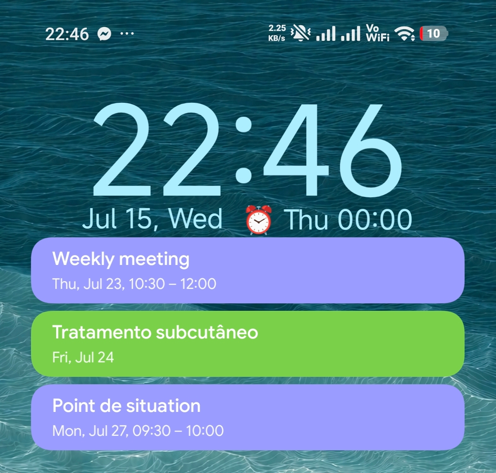

# Clock 31

Clock 31 is a Clock + Calendar combo widget for Android, inspired by (but not forked from) the cLock widget found in old versions of LineageOS.

This is a personal fork with a restyled look inspired by the Android 12+ / HyperOS lock screen: the clock and date pick up a color from your wallpaper (Material You), and the calendar is shown as solid, Google-Calendar-style colored blocks.

The widget shows the current time and date, the next alarm (if any), and upcoming events from all your calendars. Each event is drawn as a rounded block in its calendar's color. Some useful shortcuts are also provided: tapping the clock opens the clock and alarm app, and tapping an event opens that event in your calendar.

## What's new in this fork

- **Wallpaper-based color** — on Android 12 and newer, the clock and date are tinted from your wallpaper (the same Material You palette the lock screen uses). Older Android versions keep the classic white look.
- **Lock-screen-style fonts** — the clock and date use MiSans (the HyperOS look); the calendar uses Google Sans, like Google Calendar. Because home-screen widgets can't apply custom fonts to text directly, these are rendered to images in code.
- **Google-Calendar-style events** — each event is a solid rounded block in its calendar color with clean white text, instead of a plain list with a color bar.
- **Agenda view** — events are grouped by day (Today / Tomorrow / date) with a relative time on imminent events ("Now", "in 25 min").
- **Weather** — the current temperature and a wallpaper-tinted weather icon show next to the date, via the free, keyless [Open-Meteo](https://open-meteo.com) API and your device's approximate location.
- **Handy taps** — tap the clock to open your clock/alarm app; tap the date to open your calendar on today; tap an event to open it.
- **Settings** — an optional config screen for color tone (wallpaper / neutral / white), a clock-only mode, and weather on/off + °C/°F. Defaults keep everything automatic.
- **Cleaner layout** — the calendar icon and the left divider column were removed so events span the full width, and the list snaps to whole blocks so no partial row is clipped (it's still scrollable).

## Download

This fork is distributed as a **GitHub Release** on this repository — grab the APK from the [Releases page](../../releases). The wallpaper color activates automatically on Android 12+; no setup or settings.

> The original app by Federico Dossena is on F-Droid at
> [`com.dosse.clock31`](https://f-droid.org/packages/com.dosse.clock31/). This fork
> is not affiliated with the F-Droid listing.

## Compatibility

Android 5.0 (SDK 21) or newer. The wallpaper-derived clock/date color requires Android 12 (SDK 31) or newer; on older versions the clock and date are white.

## License

Copyright (C) 2022 Federico Dossena

This program is free software: you can redistribute it and/or modify
it under the terms of the GNU General Public License as published by
the Free Software Foundation, either version 3 of the License, or
(at your option) any later version.

This program is distributed in the hope that it will be useful,
but WITHOUT ANY WARRANTY; without even the implied warranty of
MERCHANTABILITY or FITNESS FOR A PARTICULAR PURPOSE.  See the
GNU General Public License for more details.

You should have received a copy of the GNU General Public License
along with this program.  If not, see <http://www.gnu.org/licenses/>.

### Bundled fonts

This fork bundles third-party fonts under their own licenses, separate from the
GPL that covers the app's code:

- **Google Sans** (calendar) — SIL Open Font License 1.1.
- **MiSans Latin** (clock and date) — Xiaomi's MiSans Font License, free for use
  in apps.
- **Material Icons** (alarm glyph) — Apache License 2.0.

See [`THIRD_PARTY_NOTICES.md`](THIRD_PARTY_NOTICES.md) for details and the full
license texts (also shipped inside the APK next to the fonts).
